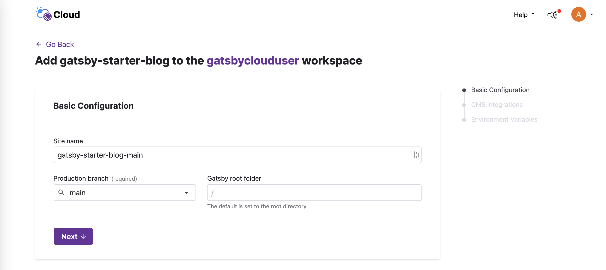
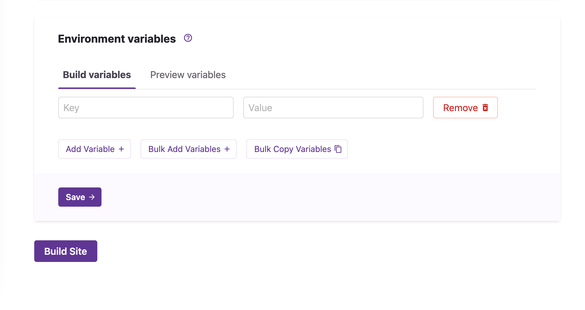
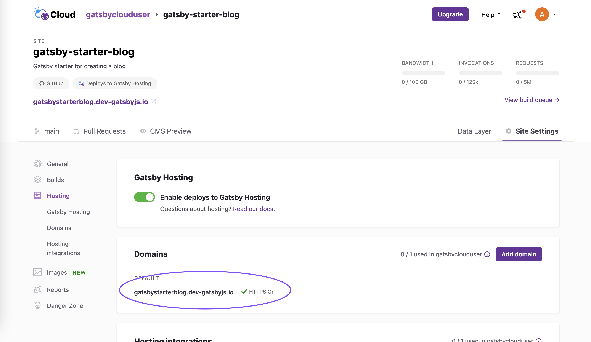

## Introduction

Gatsby Cloud allows you to create a site by importing your Gatsby project from a Git repository. This guide provides the steps for importing a repository from your Git provider and building that site on Gatsby Cloud.

## Prerequisites

You can use the [gatsby-starter-blog](https://github.com/gatsbyjs/gatsby-starter-blog) as a starting point. Select **"Use this template"** to create a new repository using the starter as a template.

## Directions

### 1. Select a Git provider

From your Gatsby Cloud dashboard, click **"Add a Site"**.

In the "Import from a Git repository" section, choose your Git provider and install the Gatsby Cloud app. For the sake of this article you'll use Github, however GitLab and BitBucket are also supported.

### 2. Specify repository details

Once connected to your Git provider, find the repository you would like to add to Gatsby Cloud and click **"Import"**. You can then provide the details for your site:

1. The site name (defaults to `<repo name>-<branch name>`).
1. The branch to import from and set as your "Production branch" in Gatsby Cloud (in this case, the `main` branch).
1. The base directory, i.e., the directory containing the Gatsby site (the root directory, `/`, is default).

After you enter the site details, click **"Next"**.

### 3. Add optional integrations

Next, you will be prompted to connect an optional content management system (CMS) to your site. This step will vary depending on the CMS provider, so there are [separate tutorials](https://support.gatsbyjs.com/hc/en-us/articles/1500000746742) for each supported CMS. However, for this specific example, you can scroll past this card to continue on.

### 4. Configure environment variables

Now, you will be asked to [set up environment variables](/docs/reference/cloud/managing-environment-variables) for your site. The "Default" starter does not use any environment variables so you will skip this step as well. Click **"Build Site"** to continue.

### 5. Finish

Once your site is done building, you can view the site in two places:

#### Private build URL

Use the build URL to preview the deployed site. This URL is not indexed and is only accessible via direct link.

#### Public default domain

Use your Gatsby Hosting provided "default domain" to access the public deployment of your site. Gatsby Hosting is turned on by default and the "default domain" is listed under "Site Settings > Hosting".

### Troubleshooting

When creating a site from a Github repository, you'll be asked to authenticate with Github. In instances where you're having trouble authenticating and importing your site:

1. Log out and log back in. If you are still aren't able to import the site, your Github repository is part of a Github organization, and you are not an owner of that organization, then you may not have sufficient permission to install the Gatsby Cloud app to Github.
1. When you try to import your repository to Gatsby Cloud, an email is sent to the owner(s) of that organization to authorize Gatsby Cloud. Once they authorize via the link in that email, then you will be able to import your repository into Gatsby Cloud.
