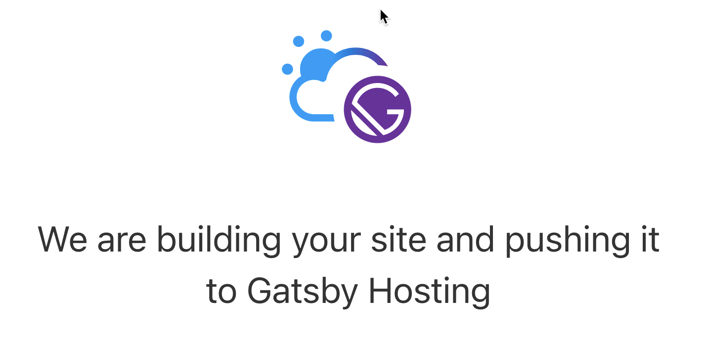

In this guide, you'll learn how to deploy your site to Gatsby Cloud Hosting.

## Prerequisites

This tutorial assumes you have already set up a Gatsby Cloud site.

## Enable Gatsby Hosting

In the Gatsby Cloud Site Hosting Settings, select **"Enable Deploys to Gatsby Cloud Hosting"**.

This will trigger a new Production Build for your site. When that Production Build completes, your site will be ready to view.

### Default domain

You will receive a "default domain" for your site base: `YOUR_SITE_PREFIX.gatsbyjs.io`. This domain has [HTTPS](https://developer.mozilla.org/en-US/docs/Glossary/https) on by default. Visit the `https://<default domain>` URL to see your hosted site.

### First deploy

Before your first Production Build after turning on Gatsby Hosting completes, you will see the following when you visit your default domain.

### Changing your default domain

You can update your default domain by changing the Site Prefix of your Gatsby site in the "General" tab of your "Site Settings".

### Other resources

- See [Adding a Custom Domain](/docs/how-to/cloud/adding-a-custom-domain) for adding a custom domain to your Gatsby Cloud site.
